**PART I**

Together, we’re going to build a game called Draft, a clone of
[*Drift*](https://vrjam.devpost.com/submissions/36336-drift): a
first-person VR game where you play as a bullet!

Some of the things you’ll learn in this tutorial include how to:

-   Set up a VR game to only respond to rotation or translation, rather
    > than both

-   Add Attributes to components to make them act differently in the
    > Editor

-   Create a cool “whoosh” effect to reduce nausea

-   Apply Camera effects

-   Master Time itself!

The end of this tutorial also includes an optional advanced section. If
you choose to complete that section as well, you’ll also learn how to:

-   Create a single class to manage your levels

-   Load levels into a unifying scene

-   Customize the Unity Editor itself!

Create a new 3D Project in Unity, as usual, and name it Drift.

Create a new folder called Scenes, and save the current Scene to that
folder with the name “Play.” This will be where we’ll set up our Player
and Goal.

Open up the Asset Store and import the SteamVR Plugin.

Create an Empty Game Object named Player, and drag the Main Camera under
it as a child, positioning the Main Camera at (0,0,0) relative to its
parent.

Add a SteamVR\_Camera component to Main Camera. A few other components
should automatically get added when you do.

Now click the big “Expand” button on the Main Camera’s SteamVR\_Camera
component. Doing so should slightly change the hierarchy of the Main
Camera, nesting it under another Game Object with some other SteamVR
components, and giving it a neighbor.

Just to be sure everything’s working as usual, run the Scene and you
should be able to look around and move around in the space as usual.

For our game, however, we only want the Player to be able to look
around, but not be able to walk around.

If you place a Cube in the center of the room, the movement becomes even
easier to see than with just the Skybox.

We’re going to see if we can’t get rid of the translation.

To do this, we’ll want to look a little more carefully at our components
to see which one makes the head move. A little digging uncovers that
translation is caused by the SteamVR\_TrackedObject component on Main
Camera (head).

Unfortunately, this component doesn’t provide a way for us to turn off
or on motion tracking by default... Fortunately, the code is open
source!

Add the following public member variable to the component:

> public bool doesNotApplyTranslation;

Then, modify both parts of the code that set translation (originally
lines 65 and 70) to the following:

> if (!doesNotApplyTranslation) {transform.localPosition = pose.pos;}

Save the component. Now when you look in the Inspector, you should see a
new checkbox for “Does Not Apply Translation” that’s unchecked by
default!

Go ahead and check that new box.

Now run the Scene and try translating around in the space. Viola! No
more translation!

Note that the Unity Editor’s game view will still show you translating,
so the best way to see this is by watching the position of Main Camera
(head) with the new checkbox checked vs unchecked.

Now that we have the head rotation-only tracked, it’s time to make the
Player move.

Create a Components folder and, in that folder, create a new component
named “Player.”

Open Player in Visual Studios and, above the class declaration itself,

> public class Player : MonoBehaviour {

add the following:

> \[RequireComponent(typeof(Rigidbody))\]

Add a Reset method with the following definition:

> void Reset() {
>
> Rigidbody rb = GetComponent&lt;Rigidbody&gt;();
>
> rb.useGravity = false;
>
> rb.freezeRotation = true;
>
> }

Now save your component and add it to Player by dragging it from the
Project panel to Player in the hierarchy.

When you do… Viola! Player magically *also* gets a Rigidbody component
with useGravity set to false and all the rotation Constraints set to
true!

“RequireComponent” is an example of a Unity-specific C\# Attribute: a
directive you can apply to a class, function, or variable.
RequireComponent causes an additional component to be added to a Game
Object *right before* this component is added. Reset is function that
gets called *in Edit Mode* whenever a component is added to a Game
Object for the first time. Since the automatically added component gets
added before this component, we can reference it in our Reset method.
Pretty cool, huh?

RequireComponent also prevents you from removing a required component.
Try removing the Rigidbody component from your Player by clicking the
little gear icon at the top-right of the component and selecting “Remove
Component.” Unity won’t let you as long as the component that requires
it is there!

\[dialogue box\]

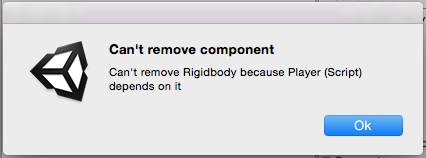

All right; that’s a sufficient amount of awe. Let’s use that Rigidbody
we’ve required to make our Player move!

We want to make our player always move forward at a constant velocity.
How will we do this?

Well, if we wanted to make our Player move in the x direction at
constant velocity, we could say something like:

> Rigidbody rb = GetComponent&lt;Rigidbody&gt;();
>
> rb.velocity = new Vector3(movementSpeed,0,0);

Where movementSpeed is a public float we can set in the Editor. If we
want to be a bit more general, we could say:

> Rigidbody rb = GetComponent&lt;Rigidbody&gt;();
>
> Vector3 direction = new Vector3(1,0,0);
>
> rb.velocity = direction \* movementSpeed;

Now all that’s left to do is find the direction. Conveniently, any
Transform’s forward direction can be obtained using the .forward
property!

With that knowledge, try making the player move forward with a constant
velocity.

\[solution: We’ve made our Player component look like this:

using UnityEngine;

using System.Collections;

> \[RequireComponent(typeof(Rigidbody))\]
>
> public class Player : MonoBehaviour {
>
> private Rigidbody rb;
>
> public Transform head;
>
> public float movementSpeed;
>
> private void Initialize() {
>
> rb = GetComponent&lt;Rigidbody&gt;();
>
> }
>
> // Use this for initialization
>
> void Start () {
>
> Initialize();
>
> }
>
> void Reset() {
>
> Initialize();
>
> rb.useGravity = false;
>
> rb.freezeRotation = true;
>
> }
>
> // Update is called once per frame
>
> void Update () {
>
> Vector3 direction = head.forward;
>
> rb.velocity = direction \* movementSpeed;
>
> }

}

We got the direction the head was facing by creating and assigning Main
Camera (head) to a public Transform variable, because the head is what
actually changes which way it’s facing.

We set movementSpeed to 1 for now, but made it public so that we could
change it later if a different value made it feel better.

You may have also noticed that we changed the implementation of Reset to
use an Initialize method, which we also put into our Start method. This
is because we didn’t want to call GetComponent every frame in our Update
method, and so wanted to make rb a member variable. The Reset method
only gets called in the Editor, so we couldn’t rely on setting it in the
Reset method, and because we wanted to do the same thing in Start and
Reset, we made it a function to reduce code duplication.

Finally, you’ll notice that we set the velocity every frame. This is
because, as the head moves, our forward direction should change as well,
and we want to check that every frame.

\]

When you implemented this, you may have noticed that the Player was able
to go straight through the Cube -- and that’s no good!

How can you fix that?

\[solution: We fixed this by adding a Sphere collider to Main Camera
(head). To make it more realistic, we set its radius to 0.25 and
positioned it at the front of the camera, so that we’ll hit things right
in front of our eyes, but not things that appear behind us. If we offset
it too much, though, we risk allowing the player to clip through the
game space by turning quickly.

\]

But we can do better. In Drift, when you hit a wall, you should start
back at the beginning. In order to do this, we’re going to restart the
scene whenever our Player hits anything.

Go ahead and make the current scene restart when you hit anything. As a
hint, even though the Sphere Collider isn’t directly on the specific
Game Object that has the Player component, we can still put the
OnCollisionEnter method in Player and receive collisions from its
children.

\[solution: We added a using statement to the top of Player:

using UnityEngine.SceneManagement;

Then we added an OnCollisionEnter method:

> void OnCollisionEnter(Collision col)
>
> {
>
> SceneManager.LoadScene(SceneManager.GetActiveScene().name);
>
> }

\]

You may have noticed that the lighting changes when the level reloads,
because we haven’t built our lights. We’ll actually want our final game
to be totally enclosed, so we don’t actually want a Skybox at all.
Rather than building lighting, set the Skybox in the Lighting Window to
None.

Before we add the goal, let’s make our level look a little more the way
we want it. For our first level, we can just make a channel for your
player to go down. If you build it out of Planes, you’ll be able to see
through from the back, which will be helpful when you want to add more
elements to your levels later.

So that we could use it later, we made our tube of Planes into a Prefab.

Let’s also make our level look a little prettier. If you remember the
original Drift, it had these neat orange shadows.

To do this, go into the Lighting Window and set the Ambient Color to
orange.

Now your lights will cast orange shadows!

It’s a little difficult to see clearly now, so we’ve added a few more
Directional Lights, made them all white, and given them different
rotations and intensities.

To complete our game loop, let’s create a goal for the Player to reach.
When you reach it, for now, have it restart the scene, but log a
message.

Create the Goal.

\[solution: We created our Goal as a Sphere tagged with a new tag we
made, Goal. Then we changed our Player’s OnCollisionEnter method to the
following:

> void OnCollisionEnter(Collision col)
>
> {
>
> if (col.gameObject.CompareTag("Goal"))
>
> {
>
> Debug.Log("WIN!");
>
> }
>
> SceneManager.LoadScene(SceneManager.GetActiveScene().name);

}

To make our Goal stand out more, we made it use a green emissive
material and put a green haloed light on it.

We also increased our Player’s movementSpeed to 20, since it felt like
we were moving a little too slowly.

\]

Our game would look a lot better with some sort of effect to make it
look like we were coursing forward, making wakes in the wind.

To do this, we’re going to use a Particle System.

Add a Particle System Game Object as a child of Main Camera (head).

Set its y rotation to 180 and z position to 5, so that it faces the
camera. Then set it to prewarm, set its Start Lifetime to 1, Emission
Rate to 100, and Radius to 0.01. To access the Emission and Shape
properties, click the boxes to expand them.

To make the effect look better, check and expand the Size Over Lifetime
and Color Over Lifetime panels.

Click the white box next to Color to open up the Gradient Editor.

The little pointers on the top represent alpha, and the ones on the
bottom represent hue. You can click to create new ones, and move or
delete existing ones. Click on the top right one and set its alpha to 0.

This will make each particle start tinted white and end clear.

Now click on the grey box next to Size. This is the curve that
represents the size. You can add or edit key points on the curve. Grab
the farthest left one and drag it down to make a pretty curve.

This will make each particle start tiny and end big.

Together with the color shift effect, we get particles that appear to
expand into nothingness.

As a final touch to our particles, we’ll make the particles thinner.

In the Rende section, change the Render Mode to Stretched Billboard,
then set the Length Scale to -10 and the Speed Scale to -0.5.

Now the Particle System should look pretty great! To prevent some
clipping, we also moved the system back to z position 10.

Now when you fly around, you should see a wake around you. If you want
it to look a little less tethered to your face, change the Simulation
Space from Local to World. See how this change affects the way it feels.
You might like one better than the other.

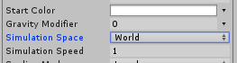

As a final gameplay step, we want to add a slow-down time mechanic.

To do this, we’ll need a reference to a SteamVR\_TrackedController in
our Scene.

Create a new component named TimeController, and make it require a
SteamVR\_TrackedController component and set that component’s index to 1
when it’s added.

\[solution: Our code to do this looks like this:

> using UnityEngine;
>
> using System.Collections;
>
> \[RequireComponent(typeof(SteamVR\_TrackedController))\]
>
> public class TimeController : MonoBehaviour {
>
> // Use this for initialization
>
> void Start () {
>
> }
>
> void Reset()
>
> {
>
> SteamVR\_TrackedController controller =
> GetComponent&lt;SteamVR\_TrackedController&gt;();
>
> controller.SetDeviceIndex(1);
>
> }
>
> // Update is called once per frame
>
> void Update () {
>
> }
>
> }

\]

Now create an Empty Game Object named TimeController and add the
TimeController component to it. This should add and set a
SteamVR\_TrackedController component, as expected.

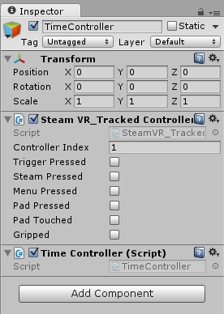

Now we can write code in our TimeController component to read the inputs
from the SteamVR\_TrackedController to make time slow down when we
squeeze the controller!

To double-check that this component is, in fact, reading inputs from the
Vive controller, by the way, run the Scene and try pressing some of the
buttons on the controller. You should see the appropriate check boxes
fill in on the component when you do.

A simple way we could freeze time would be to do the following in our
update method:

> SteamVR\_TrackedController controller =
> GetComponent&lt;SteamVR\_TrackedController&gt;();
>
> Time.timeScale = controller.gripped ? 0 : 1;

This will bring everything to a halt when you squeeze your controller,
but it is rather abrupt. How can we slow it down gradually?

One strategy would be to slowly add or subtract some small number to
Time.timeScale each frame in the following way:

> float dTimeScale = timeScaleRate \* amountOfTimeThatPassedThisFrame;
>
> if (controller.gripped) {dTimeScale \*= -1;}
>
> Time.timeScale = Mathf.Clamp01(Time.timeScale + dTimeScale);

Where timeScaleRate is some public variable and
amountOfTimeThatPassedThisFrame is how much time passed this frame, and
where Clamp01 bounds the return value between 0 and 1.

Unfortunately, we cannot use Time.deltaTime as
amountOfTimeThatPassedThisFrame, because when we change Time.timeScale,
that also scales Time.deltaTime, and so when Time.timeScale reachers 0,
Time.deltaTime will always be 0.

Fortunately, Unity provides us a metric for how much time passed each
frame that does NOT scale with Time.timeScale. That’s
Time.unscaledDeltaTime.

With that knowledge, make time slow down gradually when the player grips
the controller, and then gradually come back to normal speed when the
player un-grips.

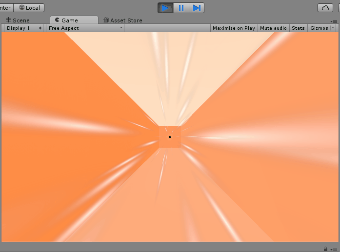

\[solution: We’ve modified our TimeController component to look like
this:

> using UnityEngine;
>
> using System.Collections;
>
> \[RequireComponent(typeof(SteamVR\_TrackedController))\]
>
> public class TimeController : MonoBehaviour {
>
> public float timeScaleRate;
>
> private SteamVR\_TrackedController controller;
>
> private void Initialize()
>
> {
>
> controller = GetComponent&lt;SteamVR\_TrackedController&gt;();
>
> }
>
> // Use this for initialization
>
> void Start () {
>
> Initialize();
>
> }
>
> void Reset()
>
> {
>
> Initialize();
>
> controller.SetDeviceIndex(1);
>
> }
>
> // Update is called once per frame
>
> void Update () {
>
> float dTimeScale = timeScaleRate \* Time.unscaledDeltaTime;
>
> if (controller.gripped) { dTimeScale \*= -1; }
>
> Time.timeScale = Mathf.Clamp01(Time.timeScale + dTimeScale);
>
> }

}

\]

Finally let’s add a Menu Scene that we’ll go back to when we win.

Create a new Scene in the Scenes folder named “Main” and remove the
Skybox.

Drag a SteamVR\_Camera component onto Main Camera. Be sure to position
Main Camera at (0,0,0).

Now add a Canvas to the Scene. Scale it to 0.1 in all dimensions, set
its Render Mode to World Space, and set its position to (0,0,100).

Now add some Text as a child to it and write something like “Squeeze
Grip to Begin.”

Now you should see some text floating in front of you.

To make the effect a little nicer, we made the Camera’s Background color
grey.

Now implement functionality to switch to the Play scene when you squeeze
the controller.

Don’t forget to add your Scenes to the Build Settings!

\[solution: We created a component called MenuController, on a
MenuController GameObject, with the following implementation:

> using UnityEngine;
>
> using System.Collections;
>
> using UnityEngine.SceneManagement;
>
> \[RequireComponent(typeof(SteamVR\_TrackedController))\]
>
> public class MenuController : MonoBehaviour {
>
> SteamVR\_TrackedController controller;
>
> private void Initialize()
>
> {
>
> controller = GetComponent&lt;SteamVR\_TrackedController&gt;();
>
> }
>
> // Use this for initialization
>
> void Start () {
>
> Initialize();
>
> }
>
> void Reset()
>
> {
>
> Initialize();
>
> controller.SetDeviceIndex(1);
>
> }
>
> // Update is called once per frame
>
> void Update () {
>
> if (controller.gripped)
>
> {
>
> SceneManager.LoadScene("Play");
>
> }
>
> }
>
> }

\]

Now just add logic to switch back to Main when you beat the level.

\[solution: We just replaced our log statement with this:

> SceneManager.LoadScene("Main");
>
> return;

\]

Now you have a feature-complete one-level game! If feel free to make it
more interesting than just a hallway by changing the path and/or adding
some obstacles.

We downloaded a package off the Asset Store with low poly trees and put
them all over with the Default-Diffuse material! We also imported the
Standard Assets Effects package and applied some Bloom to the Main
Camera (eye), because Bloom looks oh so pretty. We also thought our
lights would look prettier a little brighter and played around with our
Particle System to make it more subtle (it’s now a cone and has overall
lower opacity) ;)

As a final touch, we added the title, Draft to the Main Menu, as some
pulsing Text.

Be sure to save your Scenes and save your project!

Feel free to enjoy this version on its own, or go on to the next part to
learn how to implement a level structure!

**PART II**

You know what this game could use? Levels.

Each level should have a few things in common; the Player should be able
to navigate between things to reach a Goal, to advance to the next
Level. If the Player hits anything, the Level should restart. We also
want our Player to be able to Control Time.

So that we don’t need to rebuild our Player, Goal, or TimeController,
let’s make them Prefabs.

Create a new folder called Prefabs if you don’t already have one, then
turn your Player, Goal, and TimeController into Prefabs.

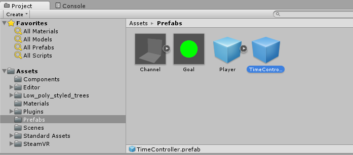

Great. Now, we want to create a system that tracks our current level and
then loads the next one.

To do this, we’ll need some test levels. The quickest way to do this is
to save copies of your Play scene. Save one as Level1, one as Level2,
and one as Level3. As a shortcut, you can copy Level1 to a scene called
Level2 by simply pressing Ctrl-D.

To help distinguish Scenes, we suggest changing the Ambient Color in the
scenes, and to make it easier to beat each level, we suggest putting the
Goal right in front of the Player and/or disabling obstacles.

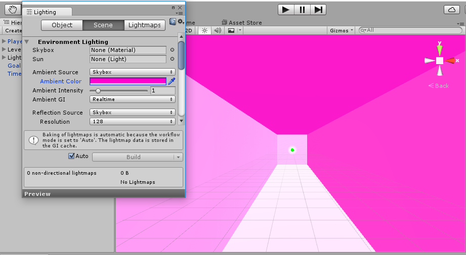

Be sure to add your new levels to the Build Settings!

Now go to Level1. Our goal is to modify our code so that we go to Level2
once we beat it, then to Level3, then to Main.

We could do this by changing the code in Player’s OnCollisionEnter
method to look like the following:

> void OnCollisionEnter(Collision col)
>
> {
>
> string nextLevelName = SceneManager.GetActiveScene().name;
>
> if (col.gameObject.CompareTag("Goal"))
>
> {
>
> if (nextLevelName.Equals("Level1")) { nextLevelName = "Level2"; }
>
> else if (nextLevelName.Equals("Level2")) { nextLevelName = "Level3"; }
>
> else if (nextLevelName.Equals("Level3")) { nextLevelName = "Main"; }
>
> }
>
> SceneManager.LoadScene(nextLevelName);
>
> }

This will work, and it would be totally sufficient for a game jam, but
the process of adding a scene is rather awkward. It requires
copy-pasting a line of code, and, if we ever want to reorder the levels
or rename them… it’s not the cleanest process.

What would be much better would be to have some manager class keep track
of our current level and then give us the next one. If there is no next
one, we should go to the main menu.

In Unity, however, Game Objects, by default, don’t persist between
Scenes, so if you want something like level number to persist, you’ll
need to store it in a different way.

One convenient way of doing this is by creating some other manager class
that your components can access to keep track of the level number. We’re
going to show you how to create a singleton level manager that your
Player component can call upon to get the next level name. A singleton
is a type of class that can only ever be instantiated once, and then
every time you use it, you really refer to the same exact instance of
it!

Create a new folder called Classes, and, in that folder, create a C\#
script called “LevelManager” and open it in Visual Studios.

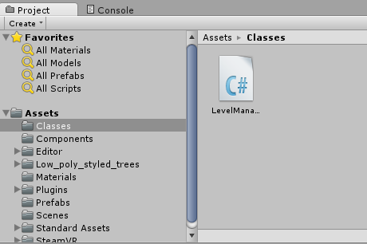

Replace the code in LevelManager with the following:

> using UnityEngine;
>
> using System.Collections;
>
> public class LevelManager : object {
>
> public static LevelManager SharedInstance = new LevelManager();
>
> static LevelManager() { }
>
> private LevelManager()
>
> {
>
> }
>
> }

There are a few differences to note between this and the other code
we’ve written in Unity. First of all, it inherits from the object class,
rather than Monobehaviour. This is because we don’t need to use it as a
component, so we just inherited from the simplest C\# class.

The private method LevelManager() is the constructor. This method will
get called when we create our only instance of this object, so we expect
it to only get called once.

The way we want to access functions or properties of our shared instance
of LevelManager is by calling LevelManager.SharedInstance.Foo() or
LevelManager.SharedInstance.Foo respectively.

To make sure that our LevelManager is truly a singleton, put some log
statement in the LevelManager’s costructor like Debug.Log(“CALLED
ONCE”), create a public Foo method that just logs something like “FOO,”
and add the following to your Player’s Update method:

> LevelManager.SharedInstance.Foo();

This should log “CALLED ONCE” just once, and then “FOO” a bunch of
times.

Great. We wanted the LevelManager to keep track of the current level, be
able to increment that level, and also be able to give us the current
level name.

A convenient way to do this is to store an array of all our level names,
store an index of the the current level name, and have our
GetCurrentLevelName return the level name at that index. Whenever we
beat a level, we’ll call some other AdvanceLevel method to advance the
index.

Try it out.

\[solution: We modified our LevelManager class to look like this:

> using UnityEngine;
>
> using System.Collections;
>
> public class LevelManager : object {
>
> public static LevelManager SharedInstance = new LevelManager();
>
> static LevelManager() { }
>
> private int currentLevelIndex;
>
> private string\[\] levelNames = { "Level1", "Level2", "Level3" };
>
> private LevelManager()
>
> {
>
> }
>
> public string GetCurrentLevelName()
>
> {
>
> if (currentLevelIndex &lt; 0 || currentLevelIndex &gt;=
> levelNames.Length) { return "Main"; }
>
> return levelNames\[currentLevelIndex\];
>
> }
>
> public void AdvanceLevel()
>
> {
>
> currentLevelIndex++;
>
> }
>
> }

We then modified our Player OnCollisionEnter method to look like this:

void OnCollisionEnter(Collision col)

{

string nextLevelName = SceneManager.GetActiveScene().name;

if (col.gameObject.CompareTag("Goal"))

{

LevelManager.SharedInstance.AdvanceLevel();

nextLevelName = LevelManager.SharedInstance.GetCurrentLevelName();

}

SceneManager.LoadScene(nextLevelName);

}

\]

This is better than before in that we only need to edit our array when
we want to add a new level, and reordering is also really easy!

But can we do better?

Is there a way to prevent our level designer from ever having to touch
code at all in order to add a new level?

As you may have guessed, there totally is ;)

If our LevelManager could figure out which of our Scenes were levels, it
could generate an array from that information without us having to write
any new code to add a new level at all!

Due to some subtleties of the Unity file system, we’re going to employ a
strategy that works like this. We’re going to write a script that
executes when we press the Play button and writes an XML file from all
the levels in a certain folder. Then our LevelManager is going to
generate its array from this XML data.

In case you’re unfamiliar with XML, XML uses bracketed tags to demark
data, like a HashTable and/or Array. It looks a lot like HTML! In this
case, we’re making a structure that’s like an Array. Knowledge about XML
won’t be necessary for this tutorial, but if you’d like to learn more,
you can find lots of information on the web, and/or ask an instructor!

The first step we’ll want to do is to try reading from an XML file.
We’ll need to put our XML file in a folder named Resources, so that we
can read it into our game during runtime using the Resources.Load method
Unity provides.

Create a new folder called Resources.

Resources is a special folder in Unity that allows us to read files from
it during runtime using a method Resources.Load&lt;T&gt;(). We our XML
file in here because we want to read it during runtime. Unity lets you
have as many folders as you want called Resources, by the way, so if you
ever want to load, say, both Prefabs and Materials via Resources.Load,
you could add a Resources folder to your Prefabs folder and to your
Materials folder, rather than being forced to change your folder
structure to accommodate your loading needs.

Now add a file to it named levels.xml using the text editor of your
choice and add the following to it:

> &lt;levels&gt;
>
> &lt;level&gt;Level1&lt;/level&gt;
>
> &lt;level&gt;Level2&lt;/level&gt;
>
> &lt;/levels&gt;

This XML includes levels 1 and 2; we’ve intentionally left out level 3
so that you can see a change from the previous version (the hard-coded
list).

Now add the following to the top of LevelManager:

> using System.Xml;

Change the declaration of levelNames to this:

> private string\[\] levelNames;

And put the following into LevelManager’s constructor:

> XmlDocument xmlDoc = new XmlDocument();
>
> TextAsset textAsset = Resources.Load("levels") as TextAsset;
>
> xmlDoc.LoadXml(textAsset.text);
>
> XmlNodeList levelsList = xmlDoc.GetElementsByTagName("level");
>
> levelNames = new string\[levelsList.Count\];
>
> for (int i = 0; i &lt; levelsList.Count && i &lt; levelNames.Length;
> ++i)
>
> {
>
> XmlNode levelNode = levelsList\[i\];
>
> levelNames\[i\] = levelNode.InnerText;
>
> }
>
> foreach (string levelName in levelNames)
>
> {
>
> Debug.Log(levelName);
>
> }

The for loop at the top is responsible for reading in our XML data and
putting it into our Array, and the foreach loop at the bottom just logs
out the level names it read so we can check whether or not this worked.

When you run this, you should see log messages appear after you hit the
first goal. Alternatively, you could just watch to be sure you only
progress through 2 levels.

Now that we’re sure we’re reading from our XML file, time to write it
programatically!

Create a new folder called Editor (or use an existing one if you have on
already from importing effects like Bloom).

Editor is also a special Unity folder in Unity and one that you can have
multiple of. Unity recognizes scripts in an Editor folder as Editor
scripts, which can do things in the Editor, as the name implies!

Create a new script in the Editor folder named OnBuild.

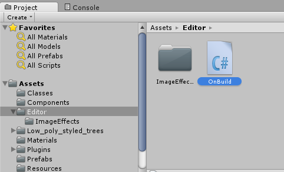

Add “using UnityEditor;” to the top. Then change the class to inherit
from object rather than Monobehaviour, give the class an
InitializeOnLoad attribute, and write an empty static constructor for
it.

\[solution: Your code should look like this:

> using UnityEditor;
>
> using UnityEngine;
>
> using System.Collections;
>
> \[InitializeOnLoad\]
>
> public class OnBuild : object {
>
> static OnBuild()
>
> {
>
> }
>
> }

\]

If you add a log statement in OnBuild, save the script, wait for it to
compile, then look in the Unity Console, you should see that message
appear!

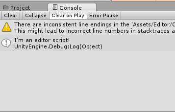

Now add the following to the constructor:

EditorApplication.playmodeStateChanged = () =&gt;

{

if (EditorApplication.isPlayingOrWillChangePlaymode)

{

Debug.Log("PLAY BUTTON PRESSED!");

}

};

The funny syntax ()=&gt; {} is a delegate, C\#’s version of lamda
functions. If you’re unfamiliar with lamba functions, think of them as
variables of type “function.” EditorApplication.playmodeStateChanged is
a delegate that gets fired whenever the Unity Editor changes its
playmode, so when you press Play, for example. By setting this function,
we’re telling the editor “hey! Do this thing whenever the the play state
changes!”

EditorApplication.isPlayingOrWillChangePlaymode is just what it sounds
like, a bool to tell us whether or not we’ve entered or will enter Play
Mode. We check for this condition so that we know we’ve hit Play
specifically.

Press the Play button, and you should see the log in the Console!

{width="2.8645833333333335in"
height="1.3020833333333333in"}

This is great, because this means we can run whatever code we want here,
for instance, the code that will write our XML.

To add that code, first add some using statements up top:

> using System.Xml;
>
> using System.IO;
>
> using System.Linq;

Then add the following code to run when we press the Play button:

DirectoryInfo info = new DirectoryInfo("Assets/Levels");

FileInfo\[\] files = info.GetFiles();

files.OrderBy(f =&gt; f.Name);

XmlDocument xmlDoc = new XmlDocument();

XmlNode rootNode = xmlDoc.CreateElement("levels");

xmlDoc.AppendChild(rootNode);

string extension = ".unity";

foreach (FileInfo file in files) {

string currentExtension = file.Extension;

if (currentExtension.Equals(extension)) {

XmlNode levelNode = xmlDoc.CreateElement("level");

levelNode.InnerText = file.Name.Replace(extension,"");

rootNode.AppendChild(levelNode);

}

}

xmlDoc.Save("Assets/Resources/levels.xml");

This code grabs all the files in Levels, sorts them by name, then adds
all the ones with a .unity extension (i.e., all Scenes) to our XML file,
then saves the XML file to the location we’d like. It’ll replace our old
XML file entirely.

Since the levels are sorted by name, by the way, if we want to reorder
them, we just need to prepend some number to the file name, like
00\_Level2, 01\_Level1, or something like that. Note that our
implementation also allows renaming in a super-simple way, since the XML
file just gets rewritten.

In order for this code to work, we’ll need to move all our levels into a
folder named Levels, so do that.

Now when you press the Play button and hit the goal, you should see that
all 3 levels were incorporated into the XML file! You can also see this
by just looking at the XML file.

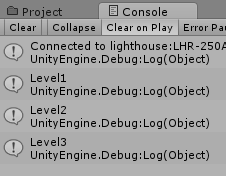

Pretty slick huh?

Now all the level designer needs to do is add the level to the Build
Settings.

But can we do better?

You’ve already guessed the answer ;)

Unity gives us an incredible amount of access to write code to do all
sorts of things in the Editor, and, as you may have guessed where this
is headed, one of these is editing the Build Settings!

You can do this by setting the array of EditorBuildSettingsScenes called
EditorBuildSettings.scenes.

You can create a new EditorBuildSettingsScene like this:

> EditorBuildSettingsScene scene = new
> EditorBuildSettingsScene(path,true);

where path is the file path to the scene name, and you can get the path
of a file by calling file.fullName.

The code gave us a bit of trouble to get right the first time, so we
definitely recommend peeking at the solution, but if you want to
challenge yourself to write it without, feel free!

\[solution:

> using UnityEditor;
>
> using UnityEngine;
>
> using System.Collections;
>
> using System.Xml;
>
> using System.IO;
>
> using System.Linq;
>
> using System.Collections.Generic;
>
> \[InitializeOnLoad\]
>
> public class OnBuild : object {
>
> static OnBuild()
>
> {
>
> EditorApplication.playmodeStateChanged = () =&gt;
>
> {
>
> if (EditorApplication.isPlayingOrWillChangePlaymode)
>
> {
>
> DirectoryInfo info = new DirectoryInfo("Assets/Levels");
>
> FileInfo\[\] files = info.GetFiles();
>
> files.OrderBy(f =&gt; f.Name);
>
> HashSet&lt;string&gt; paths = new HashSet&lt;string&gt;();
>
> foreach (EditorBuildSettingsScene scene in EditorBuildSettings.scenes)
>
> {
>
> string path = scene.path;
>
> paths.Add(path);
>
> }
>
> XmlDocument xmlDoc = new XmlDocument();
>
> XmlNode rootNode = xmlDoc.CreateElement("levels");
>
> xmlDoc.AppendChild(rootNode);
>
> string extension = ".unity";
>
> foreach (FileInfo file in files) {
>
> string currentExtension = file.Extension;
>
> if (currentExtension.Equals(extension)) {
>
> string path = file.FullName;
>
> if (!paths.Contains(path) && !paths.Contains(path + extension)) {
> paths.Add(path); }
>
> XmlNode levelNode = xmlDoc.CreateElement("level");
>
> levelNode.InnerText = file.Name.Replace(extension,"");
>
> rootNode.AppendChild(levelNode);
>
> }
>
> }
>
> xmlDoc.Save("Assets/Resources/levels.xml");
>
> EditorBuildSettingsScene\[\] scenesNew = new
> EditorBuildSettingsScene\[paths.Count\];
>
> int i = 0;
>
> foreach (string path in paths)
>
> {
>
> EditorBuildSettingsScene scene = new EditorBuildSettingsScene(path,
> true);
>
> scenesNew\[i\] = scene;
>
> ++i;
>
> }
>
> if (scenesNew != null)
>
> {
>
> EditorBuildSettings.scenes = scenesNew;
>
> }
>
> }
>
> };
>
> }
>
> }

This solution also currently has a bug in which it writes each level
exactly twice to the bulid settings! If you can catch what’s causing
that, let us know!

\]

Now your level designer can happily create levels without even needing
to open the Build Settings menu!

If we were satisfied now, we could just tell our Main Scene to load
Level1 instead of Play, and we’d be golden.

However, we want to do even better.

As a final step to make the level designer’s job simpler, we’ll want to
modify our level structure itself. Right now, each level was copy-pasted
from the last and included the TimeController, which was non-unique to
each level, but was unique to the idea of Play.

We want to change our implementation to start a Play scene with
everything unique to Play, but not unique to each level, and then
additively load the proper level, with everything unique to a particular
level, into that Scene.

To get ready for this, remove our TimeController from each of our
Levels, and remove everything BUT our TimeController from our Play
Scene.

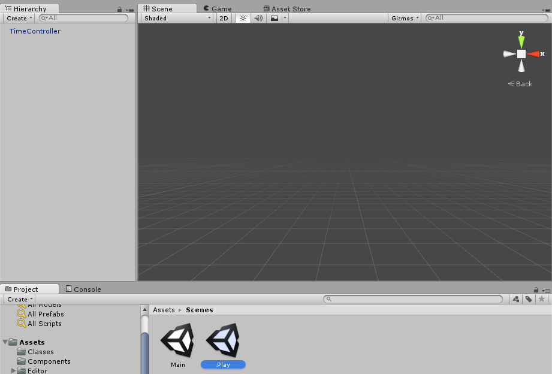

Now create a new Empty Game Object named LoadLevel, and attach a
component to it named LoadLevel.

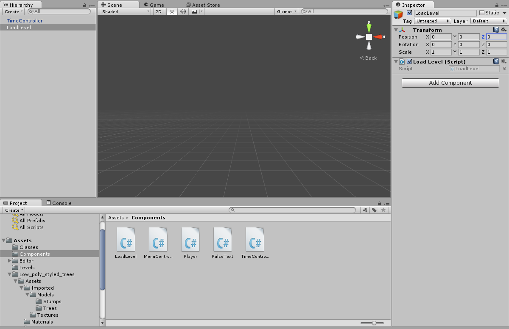

The LoadLevel component will be responsible for loading in the level
additively, and it will want to do this in another special Unity method
called Awake, that takes no arguments and is called immediately when the
component is loaded.

We can additively load any scene in Unity by calling:

> SceneManager.LoadScene(levelName, LoadSceneMode.Additive);

where levelName is the name of the level we want to load.

Try making Play additively load in the current level.

\[solution: Our LoadLevel component looks like this:

> using UnityEngine;
>
> using System.Collections;
>
> using UnityEngine.SceneManagement;
>
> public class LoadLevel : MonoBehaviour {
>
> void Awake()
>
> {
>
> string levelName = LevelManager.SharedInstance.GetCurrentLevelName();
>
> SceneManager.LoadScene(levelName, LoadSceneMode.Additive);
>
> }
>
> }

\]

When you do this, you may have noticed that the Hierarchy looks a little
unusual.

It lists both Play and Level1. Play is in bold, and Level1 is not.
There’s also this “DontDestroyOnLoad” thing here.

If you expand Play and Level1, you’ll see the objects associated with
each Scene.

Play being in bold means that its the active scene, meaning it’s the
scene you’ll get when you call SceneManager.GetActiveScene().

If Play also has an asterisk next to it, that means it has some unsaved
content.

You can get rid of that content by saving the scene before you run it.

This view, by the way, comes from Unity’s Multi Scene Editing feature,
which allows you to edit multiple Scenes in the same View.

We’re about to make each level advance to the next one when you beat the
last one. Before we do though, due to a subtlety in Unity’s Render
Settings being static, we’re going to add an object to our scene that
sets the ambient light color when the scene is loaded.

Inside one of the levels, create a new Empty Game Object named
LightingController. Add a new component to it named LightingController
with the following code inside:

using UnityEngine;

using System.Collections;

\[ExecuteInEditMode\]

public class LightingController : MonoBehaviour {

public Color color;

void Start() {

UpdateLighting();

> }
>
> void Update() {
>
> if (!Application.isPlaying) {
>
> UpdateLighting();
>
> }
>
> }
>
> private void UpdateLighting() {
>
> RenderSettings.ambientSkyColor = color;
>
> }

}

Turn it into a Prefab and add one to each level.

Then set the color on the Prefab in each Level to watch the lighting
change in the Editor!

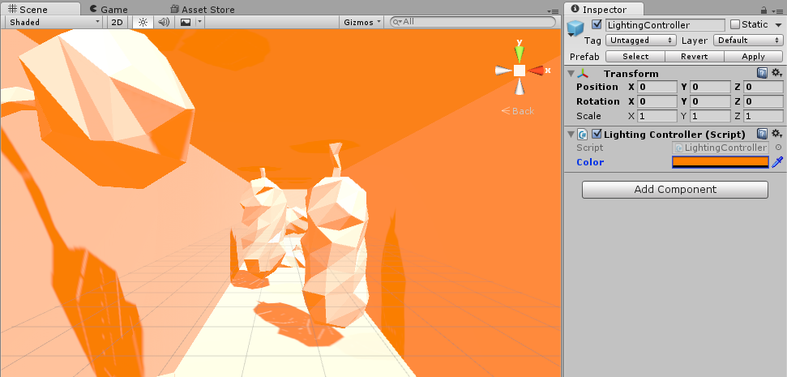

Now modify your code to make your Main start you at Play on Level1, and
so that you go to the next Level each time you beat a level. Be sure you
can use the slow-down-time feature in each Level!

\[solution: We modified our Player’s OnCollisionEnter method to look
like this:

> void OnCollisionEnter(Collision col)
>
> {
>
> string nextSceneName = SceneManager.GetActiveScene().name;
>
> if (col.gameObject.CompareTag("Goal"))
>
> {
>
> LevelManager.SharedInstance.AdvanceLevel();
>
> if (LevelManager.SharedInstance.GetCurrentLevelName() == null)
>
> {
>
> nextSceneName = "Main";
>
> }
>
> }
>
> SceneManager.LoadScene(nextSceneName);
>
> }

And we modified our Menu Controller’s Update method to look like this:

void Update () {

if (controller.gripped)

{

LevelManager.SharedInstance.ResetToFirstLevel();

SceneManager.LoadScene("Play");

}

}

\]

That’s it! You’re done! Celebrate!

Go ahead and design levels 2 and 3 if you’d like, and feel free to tweak
anything in the game you think would feel better a different way. Think
the player collider’s not great? Change it! Noticed that you can go
through walls sometimes? See if changing the Rigidbody from discrete to
continuous helps! Try something zany, go wild!

If you’d like an additional challenge, try any of the following:

-   Implement a gauge for slow-down, so that the player can’t spam it

-   Add rotating obstacles -- make sure they freeze when you freeze
    > time!

-   Add a level-select menu
