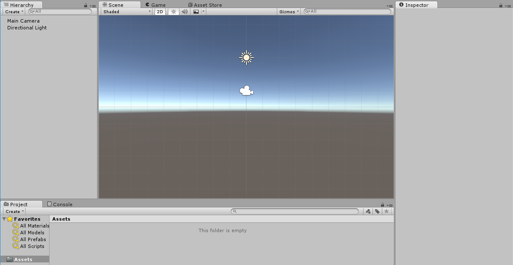
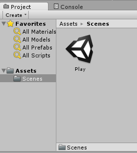
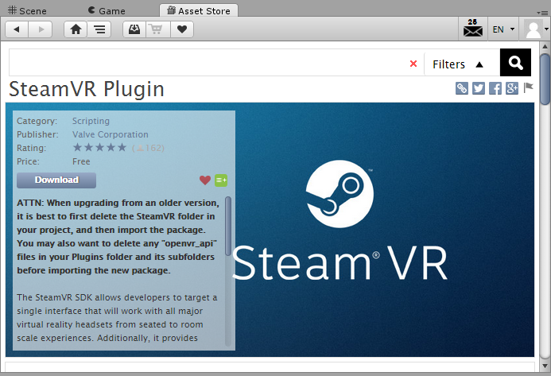
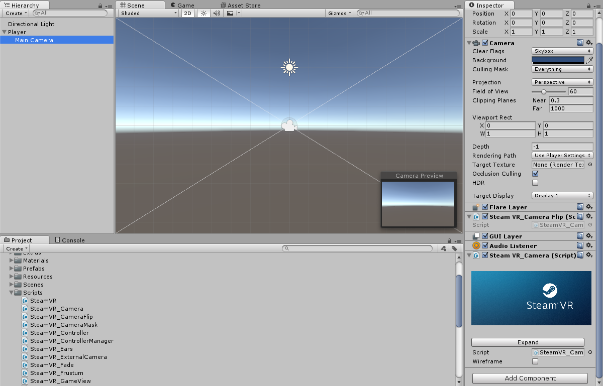
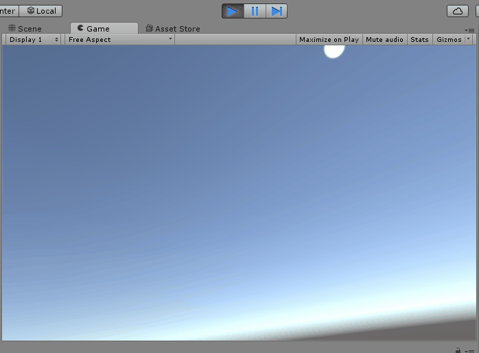
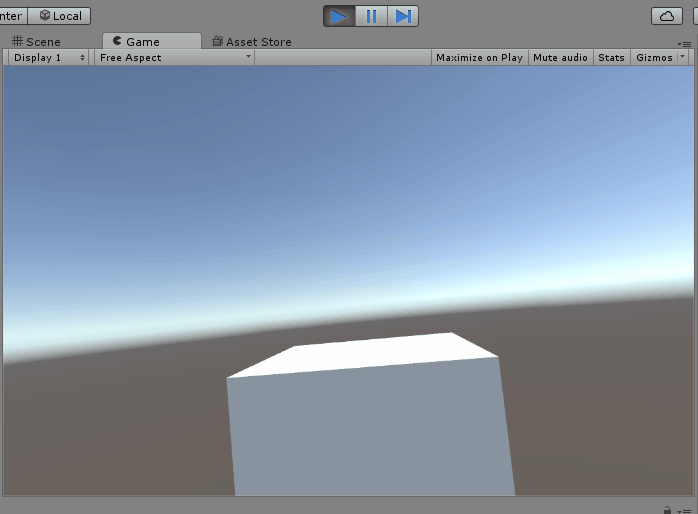
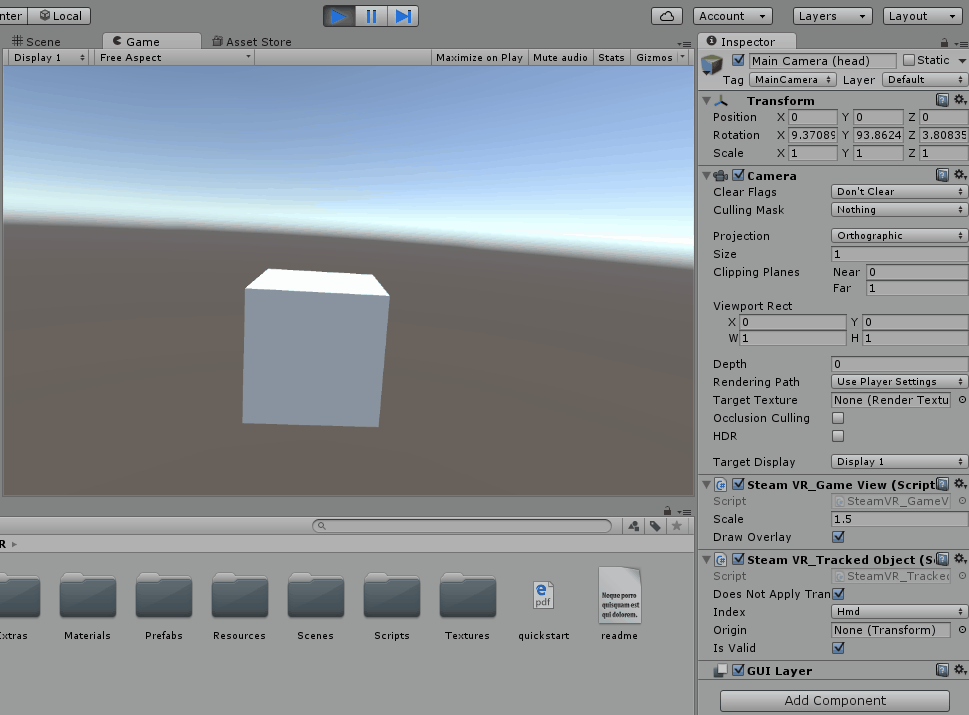
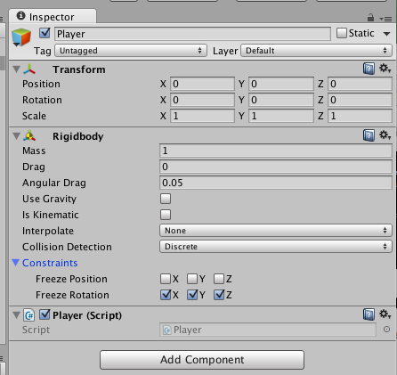
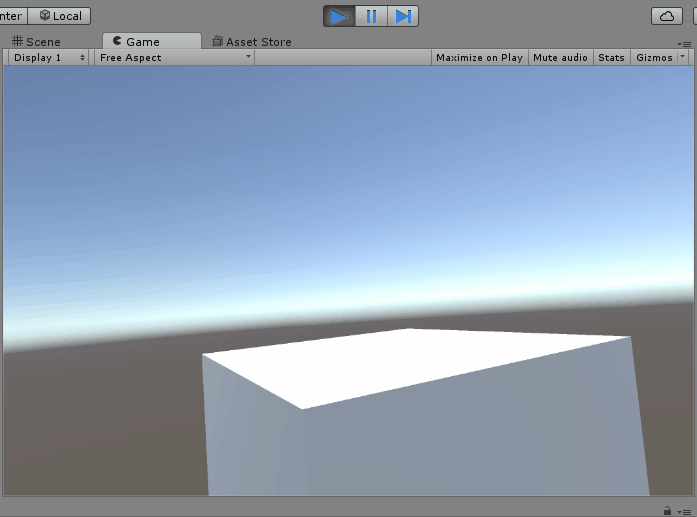
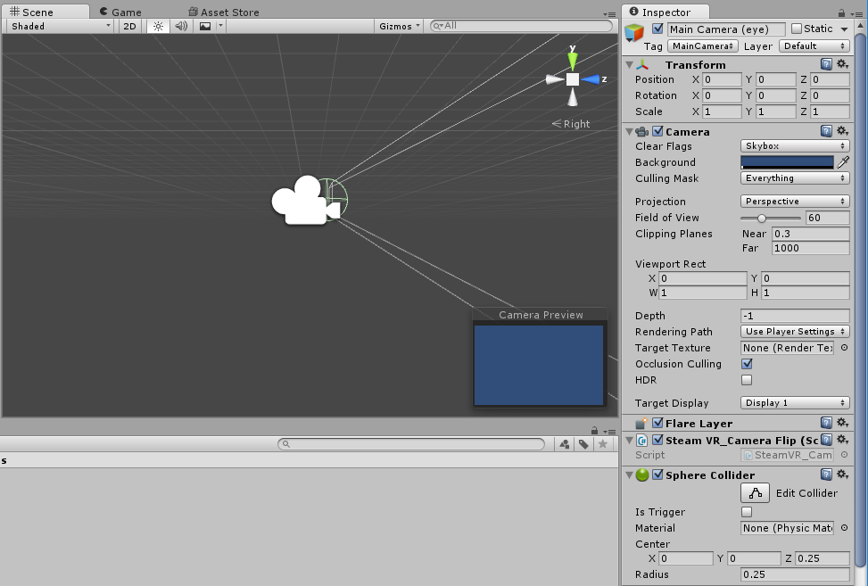

> [action]
>Create a new 3D Project in Unity, as usual, and name it Drift.



> [action]
>Create a new folder called Scenes, and save the current Scene to that folder with the name `Play.` This will be where we’ll set up our Player and Goal.



> [action]
>Open up the Asset Store and import the SteamVR Plugin.



> [action]
>Create an Empty Game Object named Player, and drag the Main Camera under it as a child, positioning the Main Camera at (0,0,0) relative to its parent.


> [action]
>Add a SteamVR\_Camera component to Main Camera. A few other components should automatically get added when you do.



> [action]
>Now click the big `Expand` button on the Main Camera’s SteamVR\_Camera component. Doing so should slightly change the hierarchy of the Main Camera, nesting it under another Game Object with some other SteamVR components, and giving it a neighbor.


> [action]
>Just to be sure everything’s working as usual, run the Scene and you should be able to look around and move around in the space as usual.



For our game, however, we only want the Player to be able to look around, but not be able to walk around.

If you place a Cube in the center of the room, the movement becomes even easier to see than with just the Skybox.



We’re going to see if we can’t get rid of the translation.

To do this, we’ll want to look a little more carefully at our components to see which one makes the head move. A little digging uncovers that translational tracking is caused by the SteamVR\_TrackedObject component on Main Camera (head).


Unfortunately, this component doesn’t provide a way for us to turn off or on motion tracking by default... Fortunately, the code is open source!

> [action]
>Can you think of a way to modify the SteamVR\_TrackedObject component in the least destructive way so that our head no longer tracks translation?

<!-- -->

> [solution]
>
>We did this by adding the following public member variable to the component:
>
```
public bool doesNotApplyTranslation;
```
>
Then we modified modify both parts of the code that set translation (originally lines 65 and 70) to the following:
>
```
if (!doesNotApplyTranslation) {transform.localPosition = pose.pos;}
```
>
Then we checked the new box that appeared for this field in the Editor.
>


<!-- -->

> [action]
>Now run the Scene and try translating around in the space. Viola! No more translation!

<!-- -->

> [info]
>Note that the Unity Editor’s game view may still show you translating, so the best way to see this is by watching the position of Main Camera (head) with the new checkbox checked vs unchecked.



Now that we have the head rotation-only tracked, it’s time to make the Player move.

> [action]
>Create a Components folder and, in that folder, create a new component named `Player," but **don't** yet add it to Player!


> [action]
>Open Player in Visual Studio and, above the class declaration itself,add the following:
>
```
[RequireComponent(typeof(Rigidbody))]
```
>
Add a Reset method with the following definition:
>
```
void Reset() {
  Rigidbody rb = GetComponent<Rigidbody>();
  rb.useGravity = false;
  rb.freezeRotation = true;
}
```

<!-- -->

> [action]
>Now save your component and add it to Player by dragging it from the Project panel to Player in the hierarchy.

When you do… Viola! Player magically *also* gets a Rigidbody component with useGravity set to false and all the rotation Constraints set to true!



`RequireComponent` is an example of a Unity-specific C# Attribute: a directive you can apply to a class, function, or variable. RequireComponent causes an additional component to be added to a Game Object *right before* this component is added. Reset is function that gets called *in Edit Mode* whenever a component is added to a Game Object for the first time. Since the automatically added component gets added before this component, we can reference it in our Reset method. Pretty cool, huh?

RequireComponent also prevents you from removing a required component.

> [action]
>Try removing the Rigidbody component from your Player. Unity won’t let you as long as the component that requires it is there!


All right; that’s a sufficient amount of awe. Let’s use that Rigidbody we’ve required to make our Player move!

We want to make our player always move forward at a constant velocity. How will we do this?

Well, if we wanted to make our Player move in the x direction at
constant velocity, we could say something like:

```
Rigidbody rb = GetComponent<Rigidbody>();
rb.velocity = new Vector3(movementSpeed,0,0);
```

Where movementSpeed is a public float we can set in the Editor. If we
want to be a bit more general, we could say:

```
Rigidbody rb = GetComponent<Rigidbody>();
Vector3 direction = new Vector3(1,0,0);
rb.velocity = direction * movementSpeed;
```

Now all that’s left to do is find the direction. Conveniently, any Transform’s forward direction can be obtained using the .forward property!

> [action]
>With that knowledge, try making the player move forward with a constant velocity.


> [solution]
>
We’ve made our Player component look like this:
>
```
using UnityEngine;
using System.Collections;
>
[RequireComponent(typeof(Rigidbody))]
public class Player : MonoBehaviour {
>
  private Rigidbody rb;
  public Transform head;
  public float movementSpeed;
>
  private void Initialize() {
    rb = GetComponent<Rigidbody>();
  }
>
  // Use this for initialization
  void Start () {
    Initialize();
  }
>
  void Reset() {
    Initialize();
    rb.useGravity = false;
    rb.freezeRotation = true;
  }
>
  // Update is called once per frame
  void Update () {
    Vector3 direction = head.forward;
    rb.velocity = direction * movementSpeed;
  }
>
}
```
>
We got the direction the head was facing by creating and assigning Main Camera (head) to a public Transform variable, because the head is what actually changes which way it’s facing.
>
We set movementSpeed to 1 for now, but made it public so that we could change it later if a different value made it feel better.
>
You may have also noticed that we changed the implementation of Reset to use an Initialize method, which we also put into our Start method. This is because we didn’t want to call GetComponent every frame in our Update method, and so wanted to make rb a member variable. The Reset method
only gets called in the Editor, so we couldn’t rely on setting it in the Reset method, and because we wanted to do the same thing in Start and Reset, we made it a function to reduce code duplication.
>
Finally, you’ll notice that we set the velocity every frame. This is because, as the head moves, our forward direction should change as well, and we want to check that every frame.

When you implemented this, you may have noticed that the Player was able
to go straight through the Cube -- and that’s no good!



> [action]
>How can you fix that?

<!-- -->

> [solution]
>
>We fixed this by adding a Sphere collider to Main Camera (head). To make it more realistic, we set its radius to 0.25 and positioned it at the front of the camera, so that we’ll hit things right
in front of our eyes, but not things that appear behind us. If we offset it too much, though, we risk allowing the player to clip through the game space by turning quickly.
>


But we can do better. In Drift, when you hit a wall, you should start back at the beginning. In order to do this, we’re going to restart the scene whenever our Player hits anything.

> [action]
>Go ahead and make the current scene restart when you hit anything. As a hint, even though the Sphere Collider isn’t directly on the specific Game Object that has the Player component, we can still put the OnCollisionEnter method in Player and receive collisions from its children.


> [solution]
>
>We added a using statement to the top of Player:
>
```
using UnityEngine.SceneManagement;
```
>
Then we added an OnCollisionEnter method:
>
```
void OnCollisionEnter(Collision col) {
  SceneManager.LoadScene(SceneManager.GetActiveScene().name);
}
```

You may have noticed, by the way, that the lighting changes when the level reloads, because we haven’t built our lights. We’ll actually want our final game to be totally enclosed, so we don’t actually want a Skybox at all.

> [action]
>Rather than building lighting, set the Skybox in the Lighting Window to
None.


