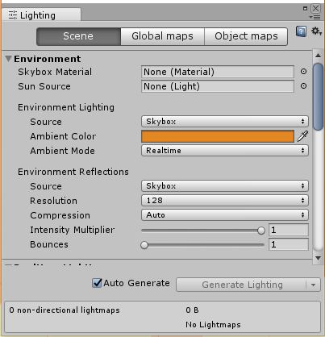
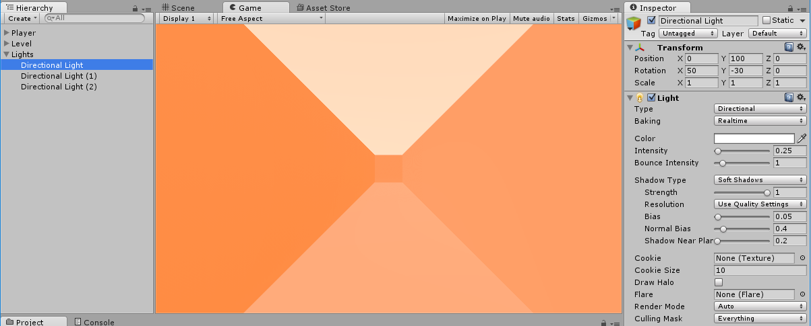

Our game loop is nearly complete but we need a goal for our player to reach!

> [action]
>
Before we add the goal, let’s make our level look a little more the way we want it. For our first level, we can just make a channel for our player to go down. If you build it out of Planes, you’ll be able to see through from the back, which will be helpful when you want to add more elements to your levels later.
>


So that we could use it later, we made our tube of Planes into a Prefab.

Let’s also make our level look a little prettier. If you remember the original Drift, it had these neat orange shadows.

> [action]
>
To do this, go into the Lighting Window and set the Ambient Color to orange.
>


Now your lights will cast orange shadows!


It’s a little difficult to see clearly now, so we’ve added a few more Directional Lights, made them all white, and given them different rotations and intensities.

> [challenge]
>
Add some more directional lights to your level.

<!--  -->

> [info]
>
When you added lights, you may have thought to yourself, "wait a gosh darn moment! My directional lights aren't casting shadows from the backs of the planes!"  That's right. Planes are one-sided in Unity, meaning that things like lighting and collisions can only hit them in the direction opposite to the normal. This is also why you can see through Planes if you look at them from behind -- which can make positioning Planes for the first time a bit tricky!
>


# Creating the goal

*Now* let’s create a goal for the Player to reach. When you reach it, for now, have it restart the scene, but log a message.

> [challenge]
>
Create the Goal.

<!-- -->

> [solution]
>
We created our Goal as a Sphere tagged with a new tag we made, `Goal`. Then we changed our Player’s `OnCollisionEnter` method to the following:
>
```
void OnCollisionEnter(Collision col) {
>
  if (col.gameObject.CompareTag("Goal")) {
    Debug.Log("WIN!");
  }
>
  SceneManager.LoadScene(SceneManager.GetActiveScene().name);
}
```
>
To make our Goal stand out more, we made it use a green emissive material and put a green haloed light on it.
>

>


>
We also increased our Player’s `movementSpeed` to `20`, since it felt like we were moving a little too slowly.
