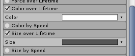
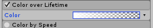
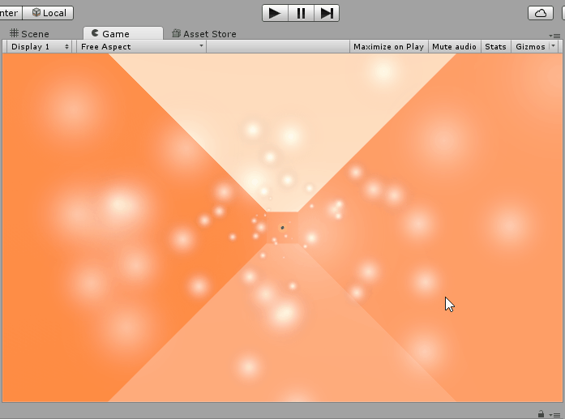
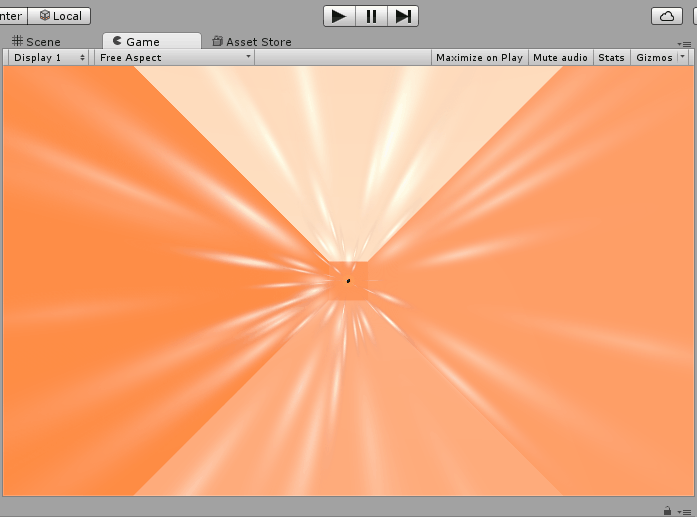

Our game would look a lot better with some sort of effect to make it
look like we were coursing forward, making wakes in the wind.

To do this, we’re going to use a Particle System.

>[action]
>Add a Particle System Game Object as a child of Main Camera (head).

>[action]
>Set its y rotation to 180 and z position to 5, so that it faces the camera. Then set it to prewarm, set its Start Lifetime to 1, Emission Rate to 100, and Radius to 0.01. To access the Emission and Shape properties, click the boxes to expand them.

>[action]
>To make the effect look better, check and expand the Size Over Lifetime and Color Over Lifetime panels.

>[action]
>Click the white box next to Color to open up the Gradient Editor.

The little pointers on the top represent alpha, and the ones on the bottom represent hue. You can click to create new ones, and move or delete existing ones. Click on the top right one and set its alpha to 0.

This will make each particle start tinted white and end clear.

>[action]
>Now click on the grey box next to Size. This is the curve that represents the size. You can add or edit key points on the curve. Grab the farthest left one and drag it down to make a pretty curve.

This will make each particle start tiny and end big.

Together with the color shift effect, we get particles that appear to
expand into nothingness.

As a final touch to our particles, we’ll make the particles thinner.

>[action]
>In the Render section, change the Render Mode to Stretched Billboard, then set the Length Scale to -10 and the Speed Scale to -0.5.

Now the Particle System should look pretty great! To prevent some
clipping, we also moved the system back to z position 10.

Now when you fly around, you should see a wake around you. If you want it to look a little less tethered to your face, change the Simulation Space from Local to World. See how this change affects the way it feels. You might like one better than the other.

