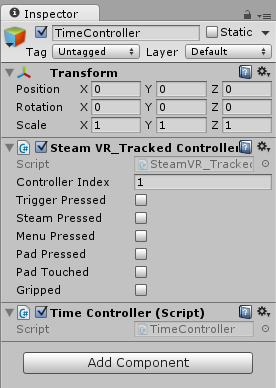
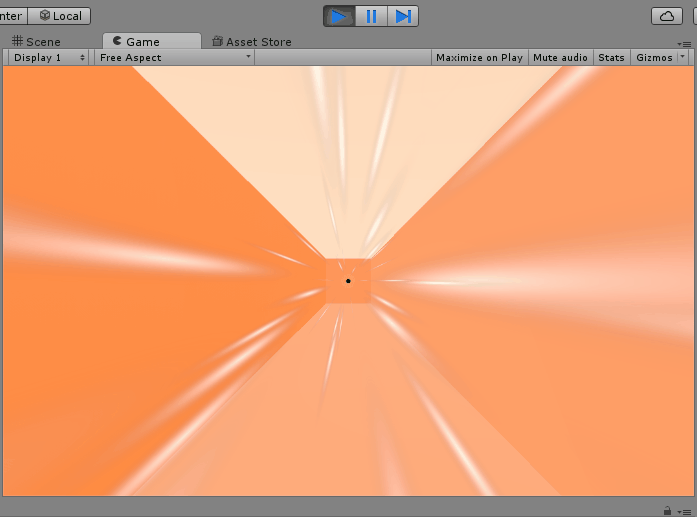

As a final gameplay step, we want to add a slow-down time mechanic.

To do this, we’ll need a reference to a `SteamVR_TrackedController` in our Scene.

> [action]
>
Create a new component named `TimeController`, and make it require a `SteamVR_TrackedController` component and set that component’s `index` to the right-most controller in `Start` and `Reset`.
>
You may find the following sample code useful...
>
```
SteamVR_TrackedController controller = GetComponent<SteamVR_TrackedController>();
int rightIndex = SteamVR_Controller.GetDeviceIndex(SteamVR_Controller.DeviceRelation.Rightmost);
controller.SetDeviceIndex(rightIndex);
```

<!-- -->

> [solution]
>
Our code to do this looks like this:
>
```
using UnityEngine;
using System.Collections;
>
[RequireComponent(typeof(SteamVR_TrackedController))]
public class TimeController : MonoBehaviour
{
    private SteamVR_TrackedController controller;
>
    // Use this for initialization
    void Start()
    {
        Initialize();
    }
>
    void Reset()
    {
        Initialize();
    }
>
    // Update is called once per frame
    void Update()
    {
>
    }
>
    void Initialize()
    {
        controller = GetComponent<SteamVR_TrackedController>();
        int rightIndex = SteamVR_Controller.GetDeviceIndex(SteamVR_Controller.DeviceRelation.Rightmost);
        controller.SetDeviceIndex(rightIndex);
    }
}
```

<!-- -->

> [action]
>
Now create an Empty Game Object named `TimeController` and add the `TimeController` component to it. This should add and set a `SteamVR_TrackedController` component, as expected.
>


Now we can write code in our `TimeController` component to read the inputs from the `SteamVR_TrackedController` to make time slow down when we squeeze the controller!

> [info]
>
To double-check that this component is, in fact, reading inputs from the Oculus Touch controller, run the Scene and try pressing some of the buttons on the controller. You should see the appropriate check boxes fill in on the component when you do.

A simple way we could freeze time would be to do the following in our update method:

```
SteamVR_TrackedController controller = GetComponent<SteamVR_TrackedController>();
Time.timeScale = controller.gripped ? 0 : 1;
```

This will bring everything to a halt when you squeeze your controller, but it's rather abrupt. How can we slow it down gradually?

One strategy would be to slowly add or subtract some small number to `Time.timeScale` each frame in the following way:

```
float dTimeScale = timeScaleRate * amountOfTimeThatPassedThisFrame;
if (controller.gripped) {dTimeScale *= -1;}
Time.timeScale = Mathf.Clamp01(Time.timeScale + dTimeScale);
```

where `timeScaleRate` is some public variable and `amountOfTimeThatPassedThisFrame` is how much time passed this frame, and where `Mathf.Clamp01` bounds the return value between `0` and `1`.

Unfortunately, we cannot use `Time.deltaTime` as `amountOfTimeThatPassedThisFrame`, because when we change `Time.timeScale`, that also scales `Time.deltaTime`, and so when `Time.timeScale` reaches `0`, `Time.deltaTime` will always be `0`.

Fortunately, Unity provides us a metric for how much time passed each frame that does NOT scale with `Time.timeScale`. That’s `Time.unscaledDeltaTime`.

> [challenge]
>
With that knowledge, make time slow down gradually when the player grips the controller, and then gradually come back to normal speed when the player un-grips.
>


<!--  -->

> [solution]
>
We’ve modified our `TimeController` component to look like this:
>
```
using UnityEngine;
using System.Collections;
>
[RequireComponent(typeof(SteamVR_TrackedController))]
public class TimeController : MonoBehaviour
{
    public float timeScaleRate;
    private SteamVR_TrackedController controller;
>
    // Use this for initialization
    void Start()
    {
        Initialize();
    }
>
    void Reset()
    {
        Initialize();
    }
>
    // Update is called once per frame
    void Update()
    {
        float dTimeScale = timeScaleRate * Time.unscaledDeltaTime;
        if (controller.gripped) { dTimeScale *= -1; }
        Time.timeScale = Mathf.Clamp01(Time.timeScale + dTimeScale);
    }
>
    void Initialize()
    {
        controller = GetComponent<SteamVR_TrackedController>();
        int rightIndex = SteamVR_Controller.GetDeviceIndex(SteamVR_Controller.DeviceRelation.Rightmost);
        controller.SetDeviceIndex(rightIndex);
    }
}
```
>
Don't forget to set `timeScaleRate` to something you like the feel of!
