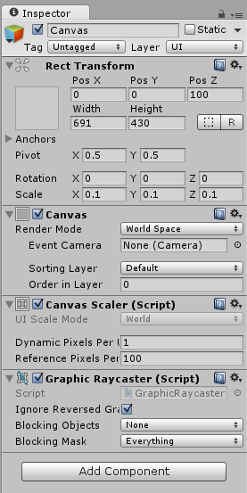
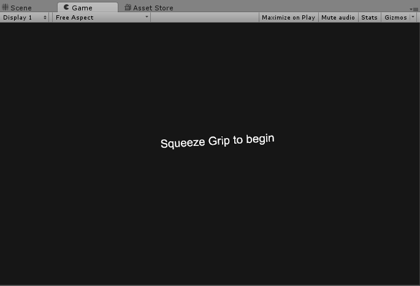
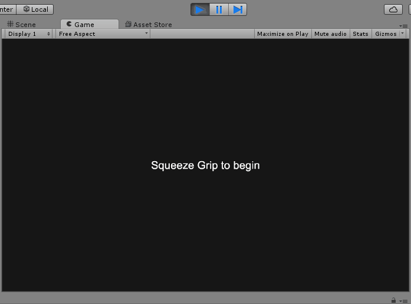
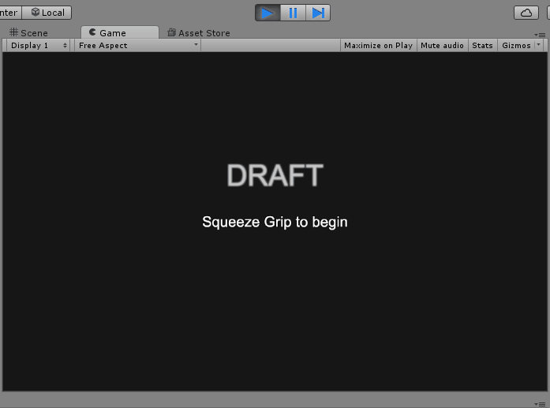

Finally let’s add a Menu Scene that we’ll go back to when we win.

> [action]
>Create a new Scene in the Scenes folder named `Main` and remove the Skybox.


> [action]
>Drag a SteamVR\_Camera component onto Main Camera. Be sure to position Main Camera at (0,0,0).


> [action]
>Now add a Canvas to the Scene. Scale it to 0.1 in all dimensions, set its Render Mode to World Space, and set its position to (0,0,100).



> [action]
>Now add some Text as a child to it and write something like `Squeeze Grip to Begin.`


Now you should see some text floating in front of you.



To make the effect a little nicer, we made the Camera’s Background color gray.

> [action]
>Now implement functionality to switch to the Play scene when you squeeze the controller.



Don’t forget to add your Scenes to the Build Settings!

> [solution]
>
>We created a component called MenuController, on a MenuController GameObject, with the following implementation:
>
```
using UnityEngine;
using System.Collections;
using UnityEngine.SceneManagement;
>
[RequireComponent(typeof(SteamVR_TrackedController))]
public class MenuController : MonoBehaviour {
>
  SteamVR_TrackedController controller;
>
  private void Initialize() {
    controller = GetComponent<SteamVR_TrackedController>();
  }
>
  // Use this for initialization
  void Start () {
    Initialize();
  }
>
  void Reset() {
    Initialize();
    controller.SetDeviceIndex(1);
  }
>
  // Update is called once per frame
  void Update () {
    if (controller.gripped) {
      SceneManager.LoadScene("Play");
    }
  }
>
}
```

<!-- -->

> [action]Now just add logic to switch back to Main when you beat the level.


> [solution]
>
>We just replaced our log statement with this:
>
```
SceneManager.LoadScene("Main");
return;
```

Now you have a feature-complete one-level game!

> [action]
>Go ahead and make it more interesting than just a hallway by changing the path and/or adding some obstacles.


We downloaded a package off the Asset Store with low poly trees and put
them all over with the Default-Diffuse material! We also imported the
Standard Assets Effects package and applied some Bloom to the Main
Camera (eye), because Bloom looks oh so pretty. We also thought our
lights would look prettier a little brighter and played around with our
Particle System to make it more subtle (it’s now a cone and has overall
lower opacity) ;)

As a final touch, we added the title, Draft to the Main Menu, as some
pulsing Text.



Be sure to save your Scenes and save your project!

Feel free to enjoy this version on its own, or go on to the next part to learn how to implement a level structure!
