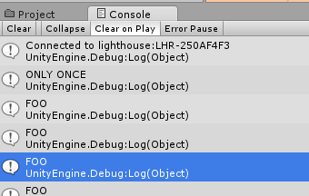

You know what this game could use? Levels.

Each level should have a few things in common; the Player should be able to navigate between things to reach a Goal, to advance to the next Level. If the Player hits anything, the Level should restart. We also want our Player to be able to Control Time.

So that we don’t need to rebuild our Player, Goal, or TimeController, let’s make them Prefabs.

>[action]Create a new folder called Prefabs if you don’t already have one, then turn your Player, Goal, and TimeController into Prefabs.


Great. Now, we want to create a system that tracks our current level and then loads the next one.

To do this, we’ll need some test levels. The quickest way to do this is to save copies of your Play scene.

>[action]
>Save one as Level1, one as Level2, and one as Level3. As a shortcut, you can copy Level1 to a scene called Level2 by simply selecting Level1 and pressing Ctrl-D.


To help distinguish Scenes, we suggest changing the Ambient Color in the scenes, and to make it easier to beat each level, we suggest putting the Goal right in front of the Player and/or disabling obstacles.


Be sure to add your new levels to the Build Settings!

>[action]
>Now go to Level1. Our goal is to modify our code so that we go to Level2 once we beat it, then to Level3, then to Main.

We could do this by changing the code in Player’s OnCollisionEnter method to look like the following:
>
```
void OnCollisionEnter(Collision col) {
>
  string nextLevelName = SceneManager.GetActiveScene().name;
>
  if (col.gameObject.CompareTag("Goal")) {
    if (nextLevelName.Equals("Level1")) { nextLevelName = "Level2"; }
    else if (nextLevelName.Equals("Level2")) { nextLevelName = "Level3"; }
    else if (nextLevelName.Equals("Level3")) { nextLevelName = "Main"; }
  }
>
  SceneManager.LoadScene(nextLevelName);
}
```

This will work, and it would be totally sufficient for a game jam, but the process of adding a scene is rather awkward. It requires copy-pasting a line of code, and, if we ever want to reorder the levels or rename them… it’s not the cleanest process.

What would be much better would be to have some manager class keep track of our current level and then give us the next one. If there is no next one, we should go to the main menu.

In Unity, however, Game Objects, by default, don’t persist between Scenes, so if you want something like level number to persist, you’ll need to store it in a different way.

>[info]
>There is a way to mark objects in Unity to not be destroyed on scene transitions, but we won't be using that for our solution.

One convenient way of doing this is by creating some other manager class that your components can access to keep track of the level number. We’re going to show you how to create a singleton level manager that your Player component can call upon to get the next level name. A singleton is a type of class that can only ever be instantiated once, and then every time you use it, you really refer to the same exact instance of it!

>[action]
>Create a new folder called Classes, and, in that folder, create a C\# script called “LevelManager” and open it in Visual Studios.


>[action]
>Replace the code in LevelManager with the following:
>
```
using UnityEngine;
using System.Collections;
>
public class LevelManager : object {
>
  public static LevelManager SharedInstance = new LevelManager();
>
  static LevelManager() { }
>
  private LevelManager() {
>
  }
}
```

There are a few differences to note between this and the other code we’ve written in Unity so far. First of all, it inherits from the object class, rather than Monobehaviour. This is because we don’t need to use it as a component, so we just inherited from the simplest C\# class.

The private method LevelManager() is the constructor. This method will get called when we create our only instance of this object, so we expect it to only get called once.

The way we want to access functions or properties of our shared instance of LevelManager is by calling LevelManager.SharedInstance.Foo() or LevelManager.SharedInstance.Foo respectively.

>[action]
>To make sure that our LevelManager is truly a singleton, put some log statement in the LevelManager’s costructor like Debug.Log(“CALLED ONCE”), create a public Foo method that just logs something like “FOO,” and add the following to your Player’s Update method:
>
```
LevelManager.SharedInstance.Foo();
```

This should log “CALLED ONCE” just once, and then “FOO” a bunch of times.



Great. We wanted the LevelManager to keep track of the current level, be able to increment that level, and also be able to give us the current level name.

A convenient way to do this is to store an array of all our level names, store an index of the the current level name, and have our GetCurrentLevelName return the level name at that index. Whenever we beat a level, we’ll call some other AdvanceLevel method to advance the index.

>[action]
>Try it out.

<!-- -->

>[solution]
>
>We modified our LevelManager class to look like this:
>
```
using UnityEngine;
using System.Collections;
>
public class LevelManager : object {
>
  public static LevelManager SharedInstance = new LevelManager();
>
  static LevelManager() { }
>
  private int currentLevelIndex;
  private string[] levelNames = { "Level1", "Level2", "Level3" };
>
  private LevelManager() {
>
  }
>
  public string GetCurrentLevelName() {
    if (currentLevelIndex < 0 || currentLevelIndex <= levelNames.Length) { return "Main"; }
    return levelNames[currentLevelIndex];
  }
>
  public void AdvanceLevel() {
    currentLevelIndex++;
  }
}
```
>
We then modified our Player OnCollisionEnter method to look like this:
>
```
void OnCollisionEnter(Collision col) {
>
  string nextLevelName = SceneManager.GetActiveScene().name;
>
  if (col.gameObject.CompareTag("Goal")) {
>
    LevelManager.SharedInstance.AdvanceLevel();
    nextLevelName = LevelManager.SharedInstance.GetCurrentLevelName();
>
  }
>
  SceneManager.LoadScene(nextLevelName);
}
```

This is better than before in that we only need to edit our array when we want to add a new level, and reordering is also really easy!

But can we do better?
