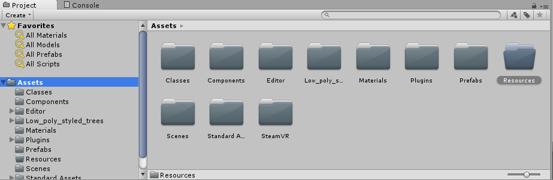
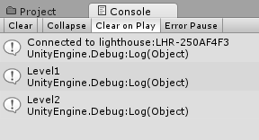
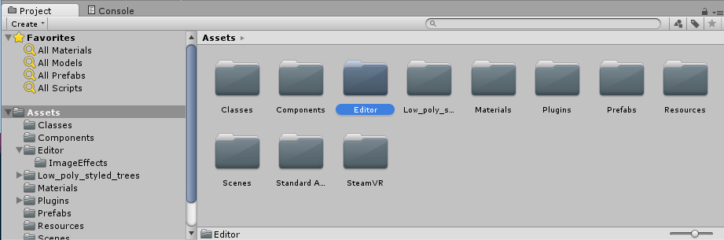
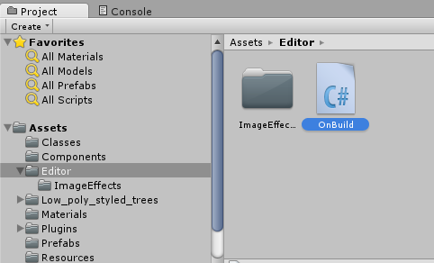
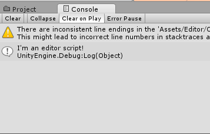
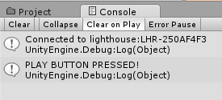
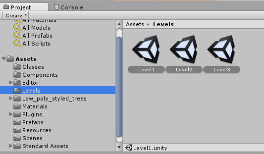
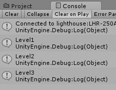
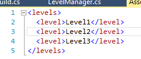

Is there a way to prevent our level designer from ever having to touch code at all in order to add a new level?

As you may have guessed, there totally is ;)

If our LevelManager could figure out which of our Scenes were levels, it could generate an array from that information without us having to write any new code to add a new level at all!

Due to some subtleties of the Unity file system, we’re going to employ a strategy that works like this. We’re going to write a script that executes when we press the Play button and writes an XML file from all the levels in a certain folder. Then our LevelManager is going to generate its array from this XML data.

>[info]
>In case you’re unfamiliar with XML, XML uses bracketed tags to demark data, like a HashTable and/or Array. It looks a lot like HTML! In this case, we’re making a structure that’s like an Array. Knowledge about XML won’t be necessary for this tutorial, but if you’d like to learn more, you can find lots of information on the web, and/or ask an instructor!

The first step we’ll want to do is to try reading from an XML file. We’ll need to put our XML file in a folder named Resources, so that we can read it into our game during runtime using the Resources.Load method Unity provides.

>[action]
>Create a new folder called Resources.



Resources is a special folder in Unity that allows us to read files from it during runtime using a method Resources.Load&lt;T&gt;(). We our XML file in here because we want to read it during runtime. Unity lets you have as many folders as you want called Resources, by the way, so if you ever want to load, say, both Prefabs and Materials via Resources.Load, you could add a Resources folder to your Prefabs folder and to your Materials folder, rather than being forced to change your folder structure to accommodate your loading needs.

>[action]
>Now add a file to it named levels.xml using the text editor of your choice and add the following to it:
>
```
<levels\>
  <level\>Level1</level\>
  <level\>Level2</level\>
</levels\>
```

This XML includes levels 1 and 2; we’ve intentionally left out level 3 so that you can see a change from the previous version (the hard-coded list).

>[action]
>Now add the following to the top of LevelManager:
>
```
using System.Xml;
```
>
change the declaration of levelNames to this:
>
```
private string[] levelNames;
```
>
and put the following into LevelManager’s constructor:
>
```
XmlDocument xmlDoc = new XmlDocument();
TextAsset textAsset = Resources.Load("levels") as TextAsset;
xmlDoc.LoadXml(textAsset.text);
XmlNodeList levelsList = xmlDoc.GetElementsByTagName("level");
levelNames = new string[levelsList.Count];
for (int i = 0; i < levelsList.Count && i < levelNames.Length; ++i) {
  XmlNode levelNode = levelsList[i];
  levelNames[i] = levelNode.InnerText;
}
>
foreach (string levelName in levelNames) {
  Debug.Log(levelName);
}
```

The for loop at the top is responsible for reading in our XML data and putting it into our Array, and the foreach loop at the bottom just logs out the level names it read so we can check whether or not this worked.

When you run this, you should see log messages appear after you hit the first goal. Alternatively, you could just watch to be sure you only progress through 2 levels.



Now that we’re sure we’re reading from our XML file, time to write it programmatically!

>[action]
>Create a new folder called Editor (or use an existing one if you have on already from importing effects like Bloom).



Editor is also a special Unity folder in Unity and one that you can have multiple of. Unity recognizes scripts in an Editor folder as Editor scripts, which can do things in the Editor, as the name implies!

>[action]
>Create a new script in the Editor folder named OnBuild.



>[action]
>Add “using UnityEditor;” to the top. Then change the class to inherit from object rather than Monobehaviour, give the class an InitializeOnLoad attribute, and write an empty static constructor for it.

<!-- -->

>[solution]
>Your code should look like this:
```
using UnityEditor;
using UnityEngine;
using System.Collections;
>
[InitializeOnLoad]
public class OnBuild : object {
>
  static OnBuild() {
>
  }
}
```

If you add a log statement in OnBuild, save the script, wait for it to compile, then look in the Unity Console, you should see that message appear!



>[action]Now add the following to the constructor:
>
```
EditorApplication.playmodeStateChanged = () => {
>
  if (EditorApplication.isPlayingOrWillChangePlaymode) {
>
    Debug.Log("PLAY BUTTON PRESSED!");
>
  }
};
```

The funny syntax ()=&gt; {} is a delegate, C\#’s version of lamda functions. If you’re unfamiliar with lamba functions, think of them as variables of type “function.” EditorApplication.playmodeStateChanged is a delegate that gets fired whenever the Unity Editor changes its playmode, so when you press Play, for example. By setting this function, we’re telling the editor “hey! Do this thing whenever the the play state changes!”

EditorApplication.isPlayingOrWillChangePlaymode is just what it sounds like, a bool to tell us whether or not we’ve entered or will enter Play Mode. We check for this condition so that we know we’ve hit Play specifically.

>[action]
>Press the Play button, and you should see the log in the Console!



This is great, because this means we can run whatever code we want here, for instance, the code that will write our XML.

>[action]
>To add that code, first add some using statements up top:
>
```
using System.Xml;
using System.IO;
using System.Linq;
```
>
Then add the following code to run when we press the Play button:
>
```
DirectoryInfo info = new DirectoryInfo("Assets/Levels");
FileInfo[] files = info.GetFiles();
files.OrderBy(f => f.Name);
>
XmlDocument xmlDoc = new XmlDocument();
XmlNode rootNode = xmlDoc.CreateElement("levels");
xmlDoc.AppendChild(rootNode);
>
string extension = ".unity";
>
foreach (FileInfo file in files) {
  string currentExtension = file.Extension;
  if (currentExtension.Equals(extension)) {
    XmlNode levelNode = xmlDoc.CreateElement("level");
    levelNode.InnerText = file.Name.Replace(extension,"");
    rootNode.AppendChild(levelNode);
  }
}

xmlDoc.Save("Assets/Resources/levels.xml");
```

This code grabs all the files in Levels, sorts them by name, then adds all the ones with a .unity extension (i.e., all Scenes) to our XML file, then saves the XML file to the location we’d like. It’ll replace our old XML file entirely.

Since the levels are sorted by name, by the way, if we want to reorder them, we just need to prepend some number to the file name, like 00\_Level2, 01\_Level1, or something like that. Note that our implementation also allows renaming in a super-simple way, since the XML file just gets rewritten.

In order for this code to work, we’ll need to move all our levels into a folder named Levels, so do that.



Now when you press the Play button and hit the goal, you should see that all 3 levels were incorporated into the XML file! You can also see this by just looking at the XML file.





Pretty slick huh?

Now all the level designer needs to do is add the level to the Build Settings.

But can we do better?
