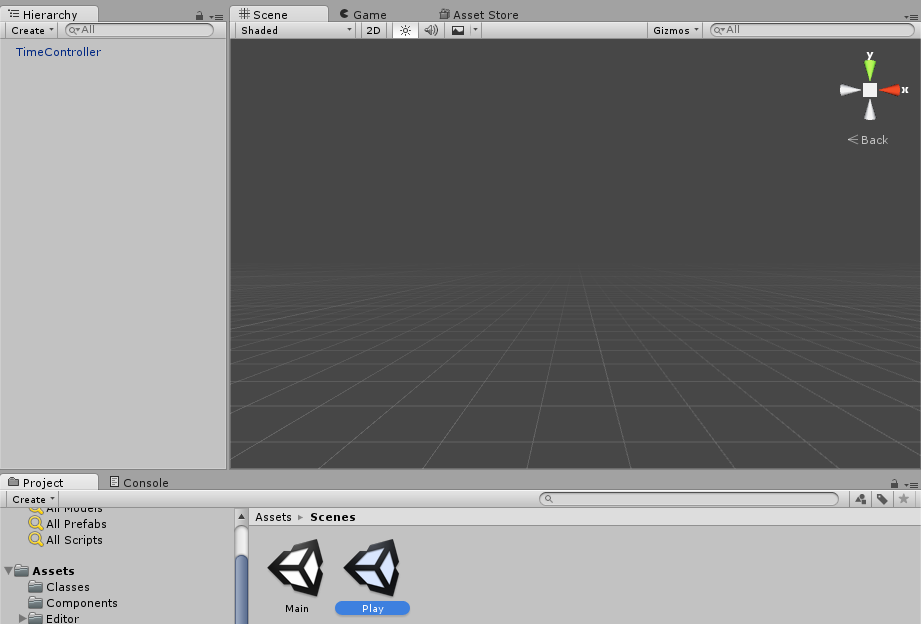
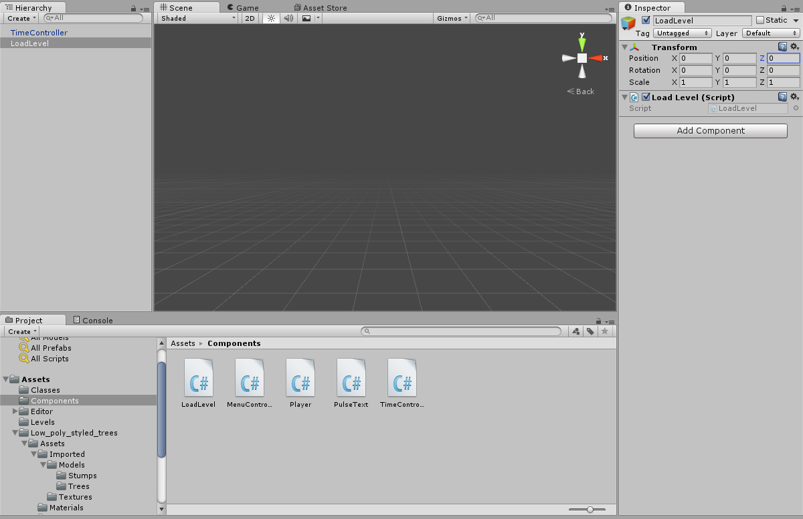
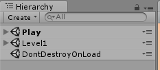
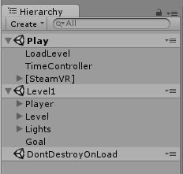
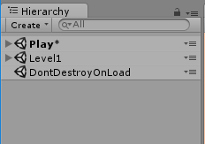
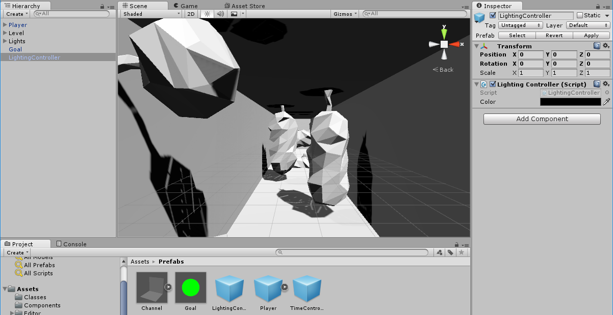
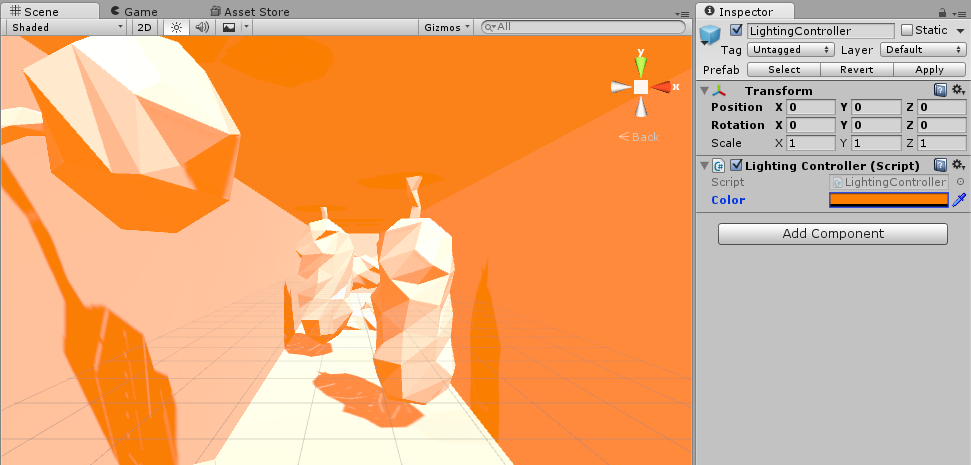

As a final step to make the level designer’s job simpler, we’ll want to modify our level structure itself. Right now, each level was copy-pasted from the last and included the TimeController, which was non-unique to each level, but was unique to the idea of Play.

We want to change our implementation to start a Play scene with everything unique to Play, but not unique to each level, and then additively load the proper level, with everything unique to a particular level, into that Scene.

>[action]
>To get ready for this, remove our TimeController from each of our Levels, and remove everything BUT our TimeController from our Play Scene.



>[action]
>Now create a new Empty Game Object named LoadLevel, and attach a component to it named LoadLevel.



The LoadLevel component will be responsible for loading in the level additively, and it will want to do this in another special Unity method called Awake, that takes no arguments and is called immediately when the component is loaded.

We can additively load any scene in Unity by calling:

```
SceneManager.LoadScene(levelName, LoadSceneMode.Additive);
```

where levelName is the name of the level we want to load.

>[action]
>Try making Play additively load in the current level.

<!-- -->

>[solution]
>
>Our LoadLevel component looks like this:
>
```
using UnityEngine;
using System.Collections;
using UnityEngine.SceneManagement;
>
public class LoadLevel : MonoBehaviour {
>
  void Awake() {
    string levelName = LevelManager.SharedInstance.GetCurrentLevelName();
    SceneManager.LoadScene(levelName, LoadSceneMode.Additive);
  }
}
```

When you do this, you may have noticed that the Hierarchy looks a little unusual.



It lists both Play and Level1. Play is in bold, and Level1 is not. There’s also this “DontDestroyOnLoad” thing here.

If you expand Play and Level1, you’ll see the objects associated with each Scene.



Play being in bold means that its the active scene, meaning it’s the scene you’ll get when you call SceneManager.GetActiveScene().

If Play also has an asterisk next to it, that means it has some unsaved content.



You can get rid of that content by saving the scene before you run it.

This view, by the way, comes from Unity’s Multi Scene Editing feature, which allows you to edit multiple Scenes in the same View.

We’re about to make each level advance to the next one when you beat the last one. Before we do though, due to a subtlety in Unity’s Render Settings being static, we’re going to add an object to our scene that sets the ambient light color when the scene is loaded.

>[action]
>Inside one of the levels, create a new Empty Game Object named LightingController. Add a new component to it named LightingController with the following code inside:
>
```
using UnityEngine;
using System.Collections;
>
[ExecuteInEditMode]
public class LightingController : MonoBehaviour {
>
  public Color color;
>
  void Start() {
    UpdateLighting();
  }
>
  void Update() {
    if (!Application.isPlaying) {
      UpdateLighting();
    }
  }
>
  private void UpdateLighting() {
    RenderSettings.ambientSkyColor = color;
  }
}
```

"ExecuteInEditMode" is an attribute that tells a bit of code to run in the Editor.  In the Editor, the Update method only gets called any time the object that has that component changes, for example, if we change the public color variable ;)

>[action]
>Turn it into a Prefab and add one to each level.



>[action]
>Then set the color on the Prefab in each Level to watch the lighting
change in the Editor!



>[action]
>Now modify your code to make your Main start you at Play on Level1, and so that you go to the next Level each time you beat a level. Be sure you can use the slow-down-time feature in each Level!

<!-- -->

>[solution]
>
>We modified our Player’s OnCollisionEnter method to look like this:
>
```
void OnCollisionEnter(Collision col) {
>
  string nextSceneName = SceneManager.GetActiveScene().name;
>
  if (col.gameObject.CompareTag("Goal")) {
    LevelManager.SharedInstance.AdvanceLevel();
    if (LevelManager.SharedInstance.GetCurrentLevelName() == null) {
      nextSceneName = "Main";
    }
  }
>
  SceneManager.LoadScene(nextSceneName);
>
}
```
>
And we modified our Menu Controller’s Update method to look like this:
>
```
void Update () {
  if (controller.gripped) {
    LevelManager.SharedInstance.ResetToFirstLevel();
    SceneManager.LoadScene("Play");
  }
}
```


That’s it! You’re done! Celebrate!

Go ahead and design levels 2 and 3 if you’d like, and feel free to tweak anything in the game you think would feel better a different way. Think the player collider’s not great? Change it! Noticed that you can go through walls sometimes? See if changing the Rigidbody from discrete to continuous helps! Try something zany, go wild!

If you’d like an additional challenge, try any of the following:

-   Implement a gauge for slow-down, so that the player can’t spam it
-   Add rotating obstacles -- make sure they freeze when you freeze time!
-   Add a level-select menu
